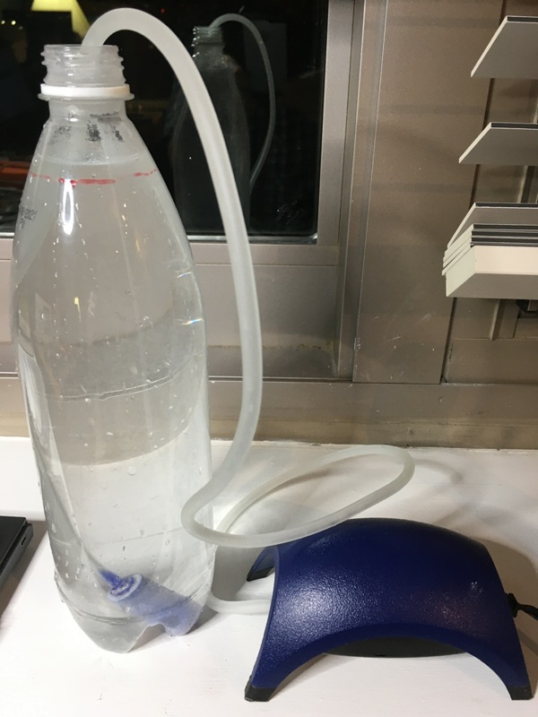

# Aqueous Cyan (Beta)

The Aqueous Cyan is an experimental alternative version of the original Cyan.

The Aqueous Cyan is a variation on the original Cyan that we have been experimenting with. As with all Cyan designs, the goal is to come up with a distributed direct-air carbon dioxide capture device that is efficient, cheap, and easy for non-technical people to build and operate.

We welcome any comments or help from people from other fields, particularly chemistry, chemical engineering, and mechanical engineering. Some ideas are in the file below.

<iframe width="100%" height="700" src="/openair-cyan/Reference_Docs/Aqueous-Cyan/Welcome%20to%20Aqueous%20Cyan--Can%20you%20help.pdf">If you are seeing this text, the preview of the CV failed. Most likely this happened because your browser does not support this technical feature. In this case, please download the CV using the link above.</iframe>

If you do not see the embedded pdf, you can try viewing the pdf here [here](/openair-cyan/Reference_Docs/Aqueous-Cyan/Welcome%20to%20Aqueous%20Cyan--Can%20you%20help.pdf). Alternatively, you can download the pdf using the link above.
